# Political Saga — MongoDB Data Architecture

## 1. Content Pipeline — Relations

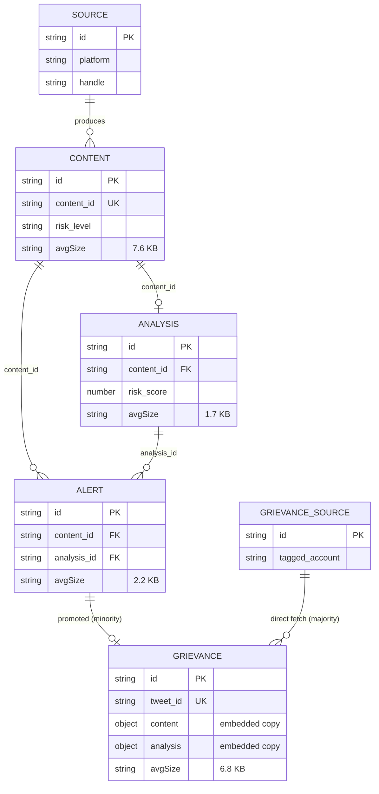

## 2. Content Pipeline — Flow: Where Each Record Comes From

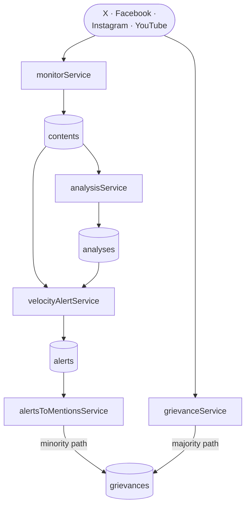

## 3. Cost of 1,000 New Documents

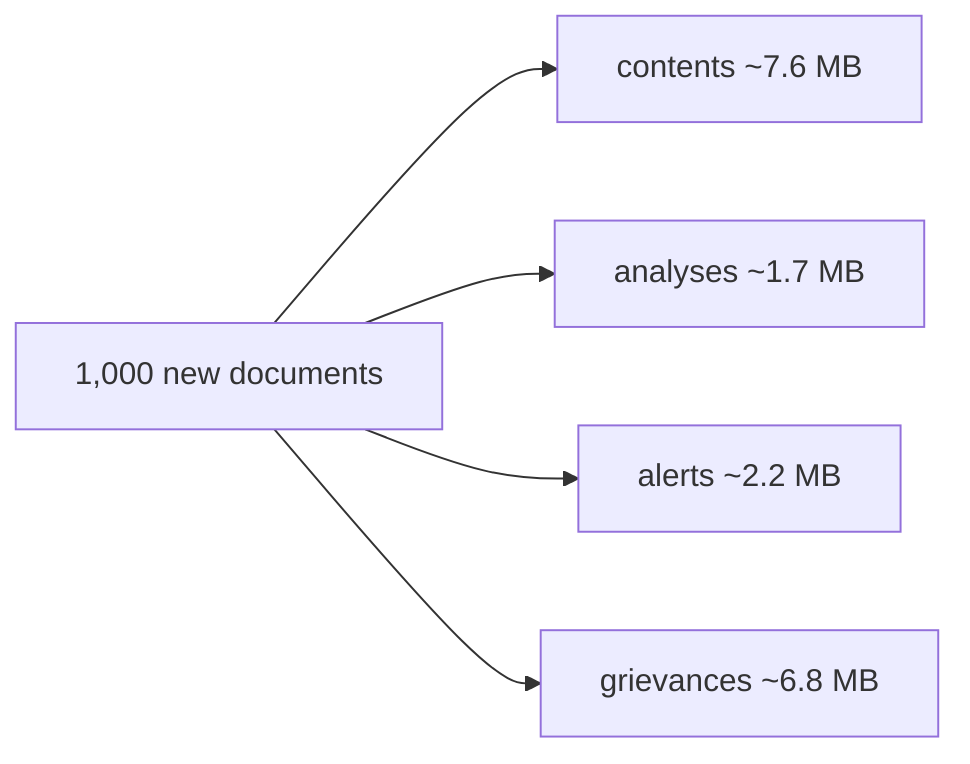

## 4. Every Active Data Domain

### 4.1 Sources & Engagement

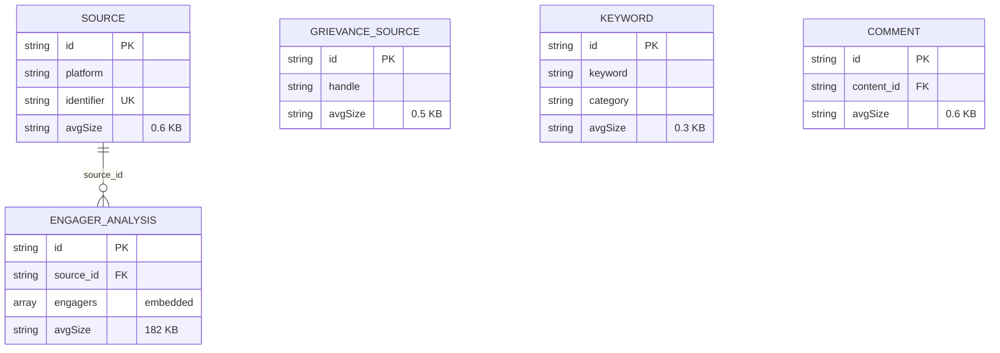

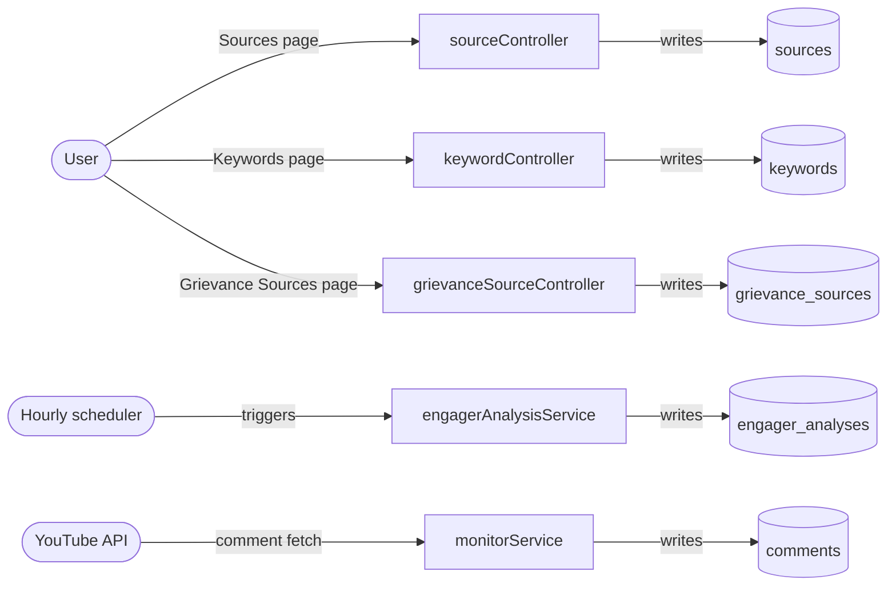

### 4.2 News & Geography

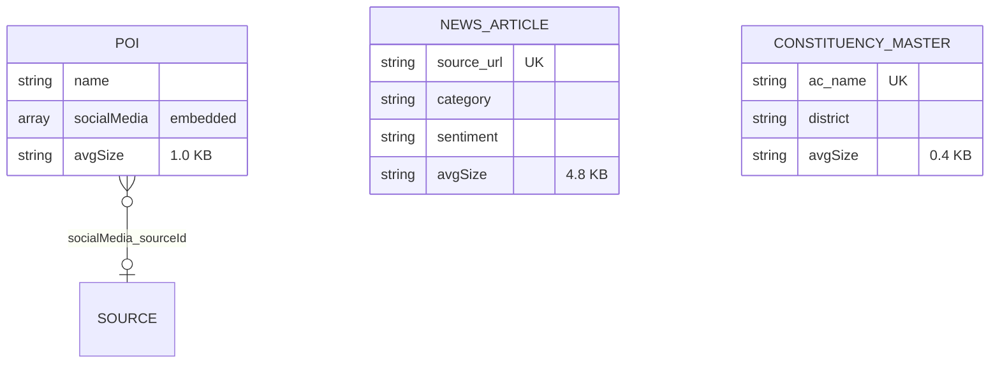

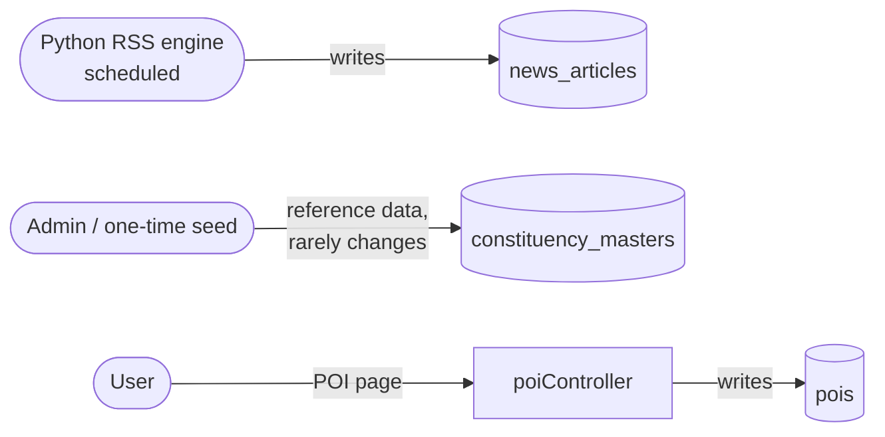

### 4.3 Events & Calendar

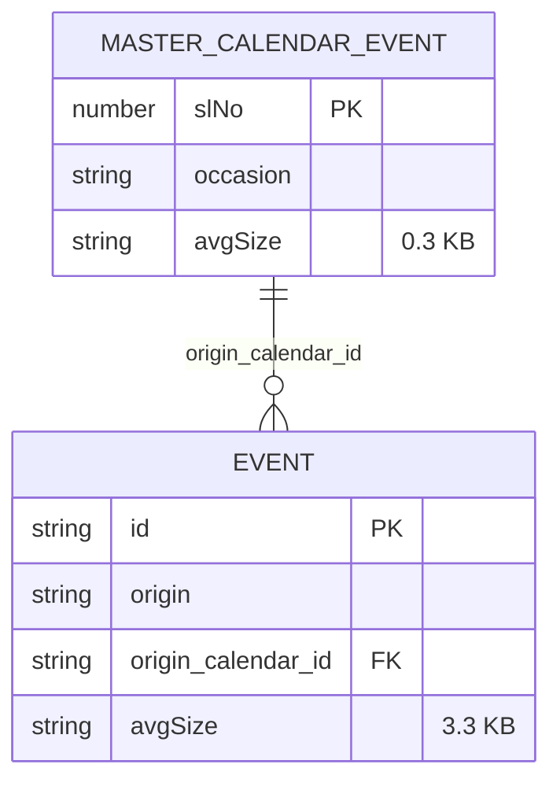

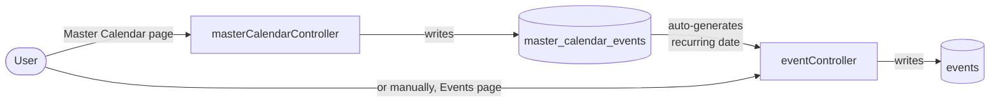

### 4.4 Identity & Access

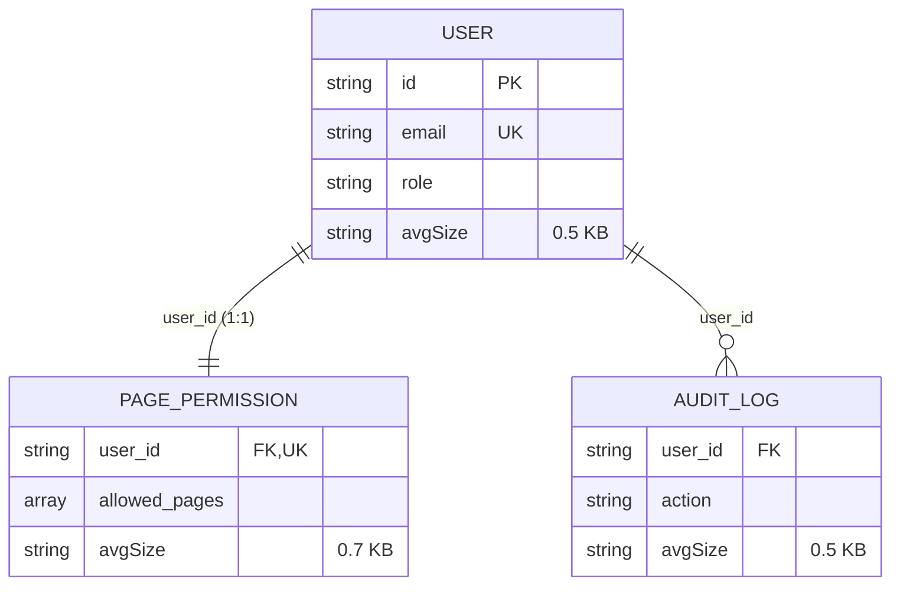

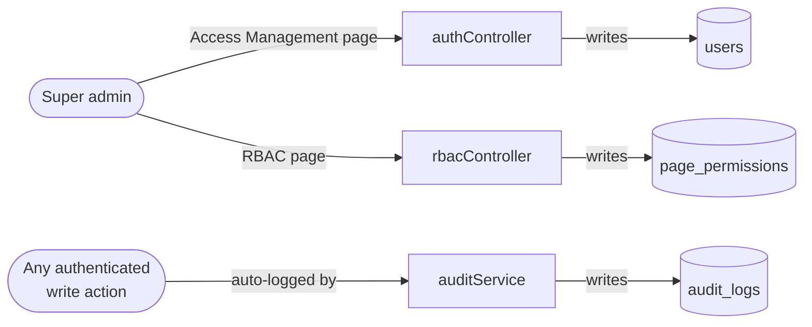

### 4.5 Policy & Configuration

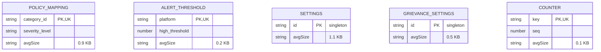

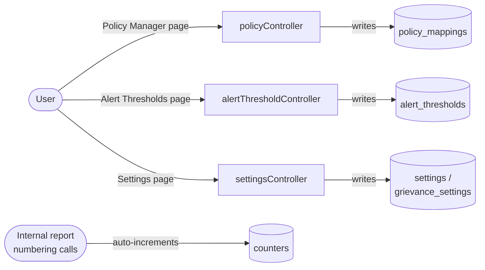

### 4.6 Search

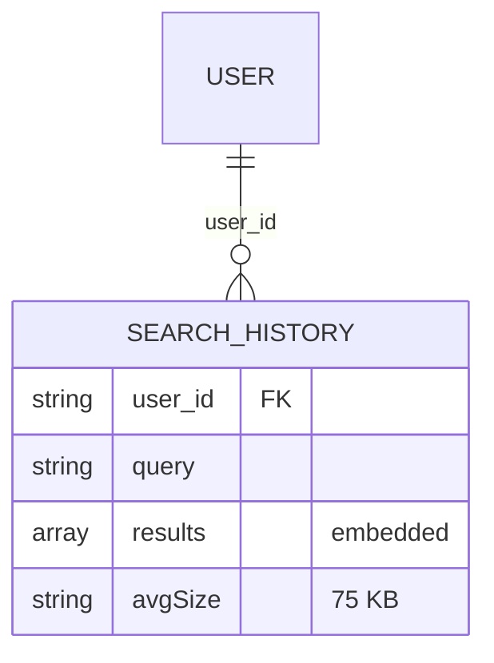

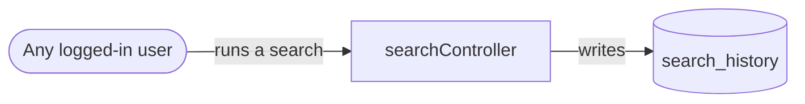
