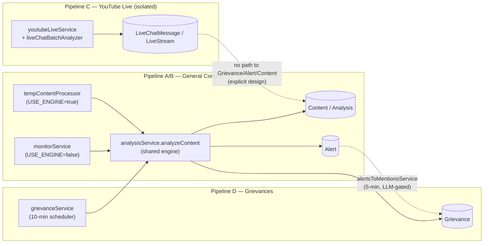
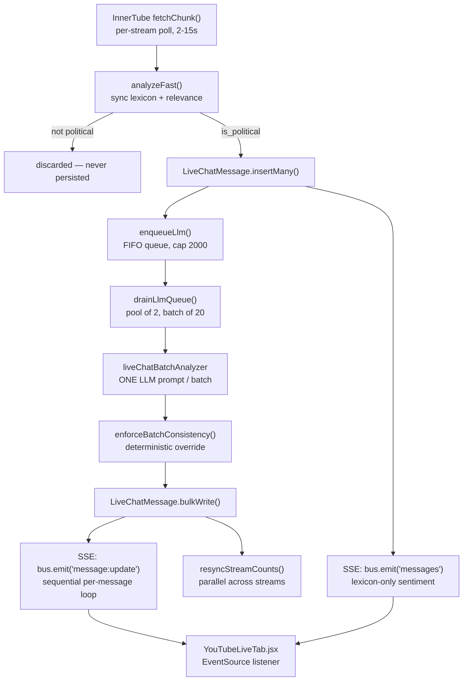
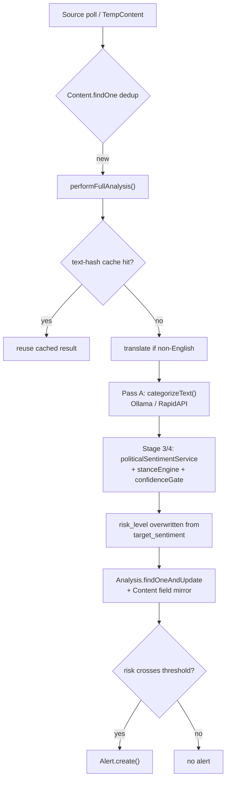

# TDP Saga — Sentiment / Alerts / Grievances Pipeline: Forensic Implementation Analysis

**Status:** Analysis only. No code was changed to produce this document.
**Method:** Every claim below was verified against the actual source at the time of writing (branch `feature/youtube-live-relevance-filter`), not inferred from file/folder names. File:line citations are given wherever possible so each claim can be re-checked directly.
**Purpose:** Ground truth for a later optimization/queue-design phase. This document intentionally does not propose fixes.

---

## 0. Executive Summary (read this first)

The single biggest structural fact: **this is not one pipeline — it is three independently-orchestrated pipelines that happen to share two pieces of infrastructure.**

| Pipeline | Trigger | Core files | Feeds |
|---|---|---|---|
| **A. Legacy direct-fetch** (`USE_ENGINE=false`, confirmed active in local `backend/.env:7`) | `monitorService.startMonitoring()` self-rescheduling loop | `monitorService.js`, `analysisService.js` | `Content`, `Analysis`, `Alert` |
| **B. Engine-fed** (`USE_ENGINE=true`) | `tempContentProcessor.js` polling `TempContent` (written by an external Python "Blura-Engine") | `tempContentProcessor.js` → same `analysisService.js`/`performFullAnalysis` as A | `Content`, `Analysis`, `Alert`, `Grievance` |
| **C. YouTube Live chat** (always on, both modes) | `youtubeLiveService.startWatcher()` | `youtubeLiveService.js`, `youtubeLiveChatReader.js`, `liveChatBatchAnalyzer.js` | `LiveStream`, `LiveChatMessage` only |
| **D. Grievance fetch** (own scheduler, independent of A/B) | `startGrievanceScheduler()` (legacy mode only) | `grievanceService.js` | `Grievance` |

A and B converge on the exact same `performFullAnalysis`/`analyzeContent` code, so they are really one analysis engine with two different ingestion front-doors. **C (YouTube Live) is completely separate** — different DB collections (`LiveChatMessage`/`LiveStream`, not `Content`), different relevance/sentiment/stance logic (hand-rolled lexicon + its own batched-LLM analyzer), different delivery mechanism (SSE, the only SSE endpoint in the whole backend), and explicitly documented in its own source as designed **not** to touch `Grievance`/`Alert`/`Content` (`youtubeLiveService.js:12-13`). Grievances (D) and Alerts (A/B) are two more independent collections, bridged only by one batch job (`alertsToMentionsService`).

**Other headline findings, detailed in the relevant sections below:**
- No message queue, no distributed worker pool, no Redis-backed job system anywhere in the backend. All scheduling is in-process `setInterval`/self-rescheduling `setTimeout`. `node-cron` is a declared dependency with zero call sites (dead).
- A hardcoded RapidAPI key literal exists as a last-resort fallback in `backend/src/services/rapidApiLLMService.js:20-24` — flagged separately below (§10) as a security-relevant finding, distinct from the architecture analysis itself.
- Confirmed dead code: `services/sentimentService.js` (zero callers), `services/aiAnalysisService.js` (zero callers), `services/googleAiModeService.js` (imported, never called), `velocityAlertService.checkAndCreateVelocityAlerts`/`createNewPostAlert` (imported, never called — `monitorService.js` reimplements the same logic inline instead), `eventMonitorService.maybeCreatePriorityAlert` (defined, not exported, not called).
- Local `.env` (`backend/.env:7`) has `USE_ENGINE=false`, i.e. **pipeline A (legacy `monitorService`) is the one actually active in this environment**, not B. Production's actual value was not confirmed by this analysis — code comments in `index.js` describe B as the intended path when a Python engine is running, but that is a description of intent, not a runtime observation. Treat production ingestion mode as an open question (see §Appendix).

---

## 1. Current End-to-End Flow

### 1.1 YouTube Live comment — the flow explicitly requested, traced literally

The requested template, replaced with what the code actually does:

```
YouTube Live Comment
   ↓ (InnerTube scrape, not the quota'd YouTube Data API)
Ingestion            → youtubeLiveChatReader.fetchChunk()          [per-stream poll, 2–15s cadence]
   ↓ (batch of new messages from this poll tick)
Fast pass (sync)     → youtubeLiveService.analyzeFast() per message [no I/O — pure JS]
   ├─ Relevance      → isChatRelevant()          — deterministic keyword/regex, HARD GATE
   └─ Placeholder    → lexiconSentimentFromTokens() + toTdpAxis()  — deterministic lexicon
      sentiment/tone/risk
   ↓ (non-relevant messages are discarded HERE — never reach DB, LLM, or UI)
Persistence (batch)  → LiveChatMessage.insertMany(relevant docs)
   ↓
SSE emit #1          → bus.emit('messages', …)   — UI sees lexicon-only result immediately
   ↓ (fire-and-forget, not awaited by the poller)
LLM queue enqueue    → enqueueLlm() → FIFO queue, worker pool of 2, batches of 20
   ↓ (async, up to ~3s later for a full batch, or whenever 20 accumulate)
LLM batch scoring    → liveChatBatchAnalyzer.analyzeBatch()  — ONE prompt for up to 20 comments
   ↓
Deterministic override → enforceBatchConsistency()  — corrects LLM stance errors in code
   ↓
Persistence (batch)  → LiveChatMessage.bulkWrite()  — updates the same rows
   ↓
Counter resync       → resyncStreamCounts()  — re-aggregates LiveStream.sentiment_counts
   ↓
SSE emit #2          → bus.emit('message:update', …) per message (sequential loop)
   ↓
UI                   → YouTubeLiveTab.jsx EventSource listener → patches message in place
```

**Stance is never computed in the fast pass** (defaults `null`); it only exists after the async LLM stage. **Risk is never independently computed anywhere** — it is a static lookup from whatever `sentiment` value is current (`SENTIMENT_TO_RISK`, `youtubeLiveService.js:257`), applied at both the lexicon stage and again after the LLM stage.

Full stage-by-stage detail with file:line citations is in §2.

### 1.2 General content (X / Facebook / Instagram / YouTube video, non-live)

```
Content ingested (monitorService poll OR TempContent from Python engine)
   ↓
Dedup check          → Content.findOne({platform, content_id})
   ↓
performFullAnalysis()  [monitorService.js:1722]
   ├─ Layer 1: keyword match (deterministic)
   ├─ Layer 2: analysisService.analyzeContent()
   │    ├─ cache check (SHA-256 of text, 7-day TTL)      — may short-circuit everything below
   │    ├─ translate non-English text (Google Translate)
   │    ├─ Pass A: llmService.categorizeText() → llmProvider.chatJson()  [Ollama qwen2.5:7b / RapidAPI GPT-4]
   │    ├─ Pass B: mappingService.resolveMapping()        — deterministic legal/policy lookup
   │    ├─ Stage 3: politicalContextService.buildPoliticalContext()  — deterministic entity scan
   │    ├─ Stage 3/4 LLM: politicalSentimentService.analyzePoliticalSentiment() → llmProvider.chatJson()
   │    ├─ Stage 4: stanceEngine.computeStance()          — deterministic ally/opposition matrix
   │    ├─ Stage 5: confidenceGate.fuse()                 — deterministic confidence fusion
   │    └─ risk_level/risk_score OVERWRITTEN from Stage 3/4 target_sentiment (not from Pass A)
   ├─ Layer 3: merge keyword hits into AI result
   └─ risk_score boundary adjustment
   ↓
Persistence           → Analysis.findOneAndUpdate({content_id}, …, {upsert:true})
                       → Content fields mirrored back (risk_score, sentiment, etc.)
   ↓
Alert decision         → if risk crosses threshold and no suppressed/duplicate alert exists:
                          Alert.create(...) + sendAlertEmail()
   ↓
API                    → frontend polls REST endpoints (no SSE for this pipeline)
```

### 1.3 Grievances

```
Scheduler (10 min) OR alert-promotion (5 min) OR manual import/WhatsApp webhook
   ↓
Fetch (RapidAPI X/FB/IG search, or YouTube Data API keyword video search)
   ↓
Dedup            → Grievance.findOne({tweet_id})     — schema-level unique index backstops this
   ↓
Grievance.save()  (content persisted BEFORE analysis — analysis is fire-and-forget-safe)
   ↓
analyzeGrievanceContent() → analysisService.analyzeContent()  [same engine as §1.2]
   ↓
buildGrievanceAnalysisUpdate() → Grievance.findOneAndUpdate({id}, {$set: analysis fields})
   ↓
extractAndSaveLocation()  — confidence-gated; <0.80 confidence → ManualReviewQueue row
   ↓
API (REST only, 10s server cache) → frontend polls on filter/pagination change (no interval poll)
```

---

## 2. Exact Function-by-Function Call Chain

### 2.1 YouTube Live — full chain (the pipeline the task asked to trace in most depth)

**Stage 0 — Boot**
`backend/src/index.js:700` → `require('./services/youtubeLiveService').startWatcher()`, wrapped in try/catch (698-703), non-fatal on failure.

**Stage 1 — Channel watcher**
- `youtubeLiveService.js:1453 startWatcher()` — loads `watch_interval_sec` from `YouTubeLiveSettings.findOne({id:'ytlive'})` (1459); `setTimeout(runWatcherOnce, 20000)` first tick (1466); `setInterval(runWatcherOnce, watchIntervalMs)` thereafter (1467, default 180s, env `YT_LIVE_WATCH_INTERVAL_MS`).
- `runWatcherOnce()` (1414-1431): `LiveStream.find({is_active:true}).lean()`, then **sequential** `for...of` with `await checkChannel(ch)` per channel (1419-1424). Guarded by a `watcherRunning` boolean so overlapping ticks no-op.
- `checkChannel(streamDoc)` (1259-1351): serialized per-channel via a `checking` Set (1267-1268); throttles re-scraping the channel's `/streams` page to once per `STREAMS_REFRESH_MS` (10 min, 1277-1280) unless forced; calls `youtubeLiveChatReader.listLiveVideos()`/`resolveLiveVideo()` — plain `axios.get` of the public page, **zero YouTube Data API quota**. Writes `LiveStream.updateOne` with `available_streams` (1331-1341), emits `bus.emit('stream:available', …)` (1342). `switchTo()` (1227-1253) stops the old poller and calls `startPoller()` when the target broadcast changes.

**Stage 2 — Per-stream poller**
- `startPoller(streamDoc)` (997-1157): one poller per `stream_id` in a module-level `pollers` Map (42, 1015) — **concurrent across streams**, each an independent self-rescheduling `setTimeout` loop.
- `tick()` (1097-1141), rescheduled via `safeTick()` (1149-1156, catches escaping rejections):
  ```js
  const chunk = await reader.fetchChunk(ctx, continuation);
  if (chunk.ended || !chunk.nextContinuation) return finish('ended');
  continuation = chunk.nextContinuation;
  if (chunk.messages.length) await persistChunk(streamDoc, chunk.messages);
  await LiveStream.updateOne({id, video_id}, {$set:{continuation, last_polled_at}});
  const youtubeWait = Math.min(Math.max(chunk.timeoutMs||5000, MIN_POLL_MS), MAX_POLL_MS); // clamp 2s–15s
  timer = setTimeout(safeTick, Math.max(youtubeWait, floor));
  ```
- `youtubeLiveChatReader.fetchChunk` (475-526): `POST https://www.youtube.com/youtubei/v1/live_chat/get_live_chat?key=<INNERTUBE_API_KEY>` — the unofficial InnerTube endpoint, not the quota'd Data API. Parses `actions[]` via `parseRenderer()`/`parseMessageRuns()` into `{message_id, author_*, text, display_parts, published_at, is_superchat, badges, video_id, …}`. One network call returns the whole batch of new messages since the last continuation cursor.
- Error handling (1129-1140): `errors` counter increments per failure; `finish('error', …)` after 5 consecutive errors; otherwise linear backoff `setTimeout(safeTick, min(15000, 3000*errors))`.

**Stage 3 — Synchronous fast pass (relevance + placeholder sentiment, no I/O)**
- `persistChunk(stream, messages)` (895-993), called once per poll tick with the whole chunk (batch, not per-message).
- `analyzeFast(text)` (821-850) run via `messages.map(...)` (898):
  ```js
  const ctx = buildPoliticalContext(text, {platform:'youtube_live'});   // politicalContextService.js:199
  const {lower, tokens} = tokenize(text);                                // youtubeLiveService.js:113-117
  const lex = lexiconSentimentFromTokens(lower, tokens);                 // youtubeLiveService.js:119-129
  const sentiment = toTdpAxis(lex.sentiment, ctx);                       // youtubeLiveService.js:270-286
  const isPolitical = isChatRelevant(lower, tokens, ctx);                // youtubeLiveService.js:727-815
  ```
  - `isChatRelevant()` — pure keyword/regex/Set lookup. Requires a *combination* of signals (entity + criticism/praise/topic, OR institution vocabulary alone, OR civic-grievance + confirming word); a bare name mention is explicitly insufficient (779-814). Large hand-curated Telugu/English/Tenglish term lists (410-707).
  - `lexiconSentimentFromTokens` — counts NEGATIVE_TERMS/POSITIVE_TERMS hits, `score = min(1, hits/3)`.
  - `toTdpAxis()` — flips polarity when the only entity named is the opposition. This is the deterministic stance-like logic at the fast-pass stage.
  - `buildPoliticalContext()` (`politicalContextService.js:199-314`) — deterministic entity/alias scan + civic-grievance lexicon + Unicode-range language-hint detection. **This is the one function genuinely shared with the general pipeline** (also called from `analysisService.js:339`).
- Relevance gate (928-932): `analyzed.filter(a => a.doc.is_political)` — non-political messages stop here permanently.
- `LiveChatMessage.insertMany(relevant.map(a=>a.doc), {ordered:false})` (938-941) — batch insert. Unique index on `message_id` (`LiveChatMessage.js:16`) absorbs duplicate-key errors from overlapping chunks; catch block (942-953) recovers partial success rather than throwing.
- Counter update `LiveStream.updateOne({$inc:{message_count, 'sentiment_counts.<x>'}})` (963-974) using the placeholder lexicon sentiment (corrected later by `resyncStreamCounts`).
- **SSE emit #1**: `bus.emit('messages', {stream_id, video_id, messages})` (991) — UI's first view, carries `analysis_provider:'lexicon'`, `stance:null`.
- Enqueue for LLM (977-987), only for genuinely newly-inserted rows: `enqueueLlm({id, text, stream_id, ctx, lexTone})` — fire-and-forget, not awaited by `persistChunk`.

**Stage 4 — Async batched LLM scoring**
- Queue/worker pool (150-253), module-level (cross-stream):
  ```js
  const llmQueue = []; let llmActive = 0;
  const enqueueLlm = (entry) => {
    if (llmQueue.length >= LLM_QUEUE_MAX /*2000*/) { llmDropped++; return false; }
    llmQueue.push(entry); drainLlmQueue(); return true;
  };
  const drainLlmQueue = () => {
    while (llmActive < LLM_CONCURRENCY /*2*/ && llmQueue.length >= LLM_BATCH_SIZE /*20*/) {
      const batch = llmQueue.splice(0, LLM_BATCH_SIZE);
      llmActive++;
      runBatch(batch).catch(...).finally(() => { llmActive--; drainLlmQueue(); });
    }
    if (llmQueue.length && !batchTimer) {
      batchTimer = setTimeout(() => { /* flush partial batch after LLM_BATCH_WAIT_MS=3000ms */ }, LLM_BATCH_WAIT_MS);
    }
  };
  ```
  Bounded pool of 2 concurrent batch workers, batch size 20, single cross-stream FIFO queue capped at 2000 (overflow = silently and permanently dropped at lexicon-only scoring). Partial batches force-flush after 3s.
- `runBatch(batch)` (156-213) calls `liveChatBatchAnalyzer.analyzeBatch(items, ctx)` (141-167):
  - `buildPrompt()` (64-98) — **one prompt for the whole batch**, up to 20 numbered comments, each truncated to 220 chars, asking only for `about` (`tdp|opposition|both|none`) and `tone` (`praise|attack|neutral`) — not the final stance, because the model is documented as unreliable at that inversion step.
  - `chatJson({prompt, temperature:0.1, maxTokens: min(4000, 120*n+400), timeoutMs: 180000})` → `llmProvider.chatJson`.
  - `deriveStance(about, tone)` (105-114) — deterministic axis flip.
  - `coerce()` (116-132) — validates against enum allow-lists, defaults unknowns to `none`/`neutral`.
  - Result: `Map<message_id, {about, stance, sentiment, tone, target_entity, reason}>`; missing/hallucinated indices are silently skipped, not error-retried.
- `enforceBatchConsistency(v, ctx, lexTone)` (296-332) — second deterministic override: when exactly one camp is named, tone alone fully determines stance, correcting the model in code (documented failure case: Telugu "Jagan is a cheater" mis-scored pro-Jagan by the 7B model).
- `LiveChatMessage.bulkWrite(ops, {ordered:false})` (200) — one bulk update per scored message, single round-trip.
- `resyncStreamCounts` (858-891) run **in parallel across distinct streams** via `Promise.all` (207): `LiveChatMessage.aggregate([{$match},{$group:{_id:'$sentiment', n:{$sum:1}}}])` → `LiveStream.updateOne` → `bus.emit('stream:counts', …)`.
- **SSE emit #2** — the one genuinely sequential per-item pattern in this pipeline (209-212):
  ```js
  for (const u of updated) {
    const doc = await LiveChatMessage.findOne({ id: u.id }).lean();
    if (doc) bus.emit('message:update', { stream_id: doc.stream_id, message: doc });
  }
  ```
  Up to 20 sequential single-document reads + emits per finished batch — not batched into one query, not parallelized.
- Batch failure handling: `runBatch(batch).catch(err => console.warn(...))` (219-220, 235-236) — a failed batch (timeout/network error) is **entirely dropped, no retry, no requeue**; those messages stay at lexicon-only scoring permanently unless someone runs the offline rescore script.

**Stage 5 — Delivery**
- `youtubeLiveRoutes.js:GET /stream` (21-109) — SSE. Auth via `?token=` query param (JWT, `EventSource` can't set headers), `res.writeHead(200, {'Content-Type':'text/event-stream', 'X-Accel-Buffering':'no', …})` (35-40). Subscribes to `liveService.bus` events `messages`, `message:update`, `stream:status`, `stream:available`, `stream:counts` (70-74), each optionally filtered by `?stream_id=`. 25s heartbeat (77). Listener cleanup on `close`/`error` (84-94) — load-bearing because `bus.setMaxListeners(0)` means leaks would never even warn.
- REST fallback/read endpoints in the same file: `GET /messages` (paginated `LiveChatMessage.find`, supports an `after` cursor for "poll fallback when SSE unavailable"), `GET /stats`, `GET /top-authors`. **No manual reprocess/reanalyze route exists.**
- Offline-only re-scoring: `backend/scripts/rescore_live_chat.js`, `backend/scripts/backfill_live_chat_sentiment.js` — run manually via `node scripts/...`, import `analyzeFast`/`enforceBatchConsistency`/`resyncStreamCounts`/`analyzeBatch` directly, re-run the full lexicon + LLM pass over stored messages. Does not call `bus.emit` — results only appear on next `/messages` fetch, not live.

### 2.2 General pipeline — key functions

| Function | File:Line | Called by | Calls | Purpose |
|---|---|---|---|---|
| `startMonitoring` / `runLoop` | `monitorService.js:2210` | `index.js:666` (`USE_ENGINE=false`) | `scanSourceOnce` (batched) | Self-rescheduling poll loop |
| `scanSourceOnce` | `monitorService.js:1522` | `runLoop` (batches of 5 via `Promise.all`) | `monitorYoutubeSource`/`monitorXSource`/`monitorInstagramSource`, `performFullAnalysis` | Per-source ingestion dispatch |
| `performFullAnalysis` | `monitorService.js:1722` | `scanSourceOnce`, `rescanContent`, `tempContentProcessor.processOneItem` | `analysisService.analyzeContent`, `Analysis.findOneAndUpdate`, `Alert.create` | Orchestrates analysis + alert decision for one content item |
| `analyzeContent` | `analysisService.js:185` | `performFullAnalysis`, `eventMonitorService`, `grievanceService.analyzeGrievanceContent`, `rssAnalysisService`, `alertController.investigateLink` | `translationService`, `llmService.categorizeText`, `mappingService.resolveMapping`, `politicalContextService.buildPoliticalContext`, `politicalSentimentService.analyzePoliticalSentiment` | The shared analysis engine — returns a result object, does not write to Mongo itself |
| `categorizeText` | `llmService.js:401` | `analysisService.js:246` | `llmProvider.chatJson` | Pass A: category/severity/department/grievance-type LLM call |
| `analyzePoliticalSentiment` | `politicalSentimentService.js` | `analysisService.js:364` | `llmProvider.chatJson`, `stanceEngine.computeStance`, `confidenceGate.fuse` | Stage 3/4/5: client-relative stance + confidence |
| `runCycle` / `tick` | `tempContentProcessor.js:475/556` | `index.js:663` (`USE_ENGINE=true`) | `runWithConcurrency` (pool of 4), `processOneItem` → `performFullAnalysis` (imported directly from `monitorService.js:8,400`) | Engine-fed ingestion, same analysis engine as A |

### 2.3 Alerts — key functions (see §4 for full detail)

| Function | File:Line | Trigger | Fires when |
|---|---|---|---|
| `performFullAnalysis` (site A) | `monitorService.js:1679` | Live poll loop | Consolidated per-post alert: velocity OR keyword OR AI risk |
| `performFullAnalysis` (site B) | `monitorService.js:2058` | `tempContentProcessor.processOneItem` (`skipAlert:false`) | Keyword match OR AI-detected risk/policy signal |
| `rescanContent` (site C) | `monitorService.js:2197` | On-demand utility, no route found wired to it | Same logic as A, over last 24h |
| YouTube manual sync (site D) | `youtube.routes.js:323` | `POST /api/youtube-monitor/channels/:id/sync` | keywords matched OR score ≥ medium threshold |
| `investigateLink` (site E) | `alertController.js:1415` | `POST /alerts/investigate` (manual) | Always creates — no threshold |
| `checkAndCreateVelocityAlerts`/`createNewPostAlert` | `velocityAlertService.js:221,288` | — | **Dead code — never called** |
| `maybeCreatePriorityAlert` | `eventMonitorService.js:188` | — | **Dead code — never called, not even exported** |

### 2.4 Grievances — key functions (see §5 for full detail)

| Function | File:Line | Trigger | Purpose |
|---|---|---|---|
| `runGrievanceFetch` | `index.js:333` | `setInterval`, 10 min | Calls both fetch paths below |
| `fetchAllGrievances` → `upsertGrievancesForSource` → `upsertXGrievancesForSource`/`upsertFacebookGrievancesForSource` | `grievanceService.js:1318/1307/1067/1140` | Scheduler | Per-tracked-account mention fetch, sequential, 2s LLM-host stagger sleep per item |
| `fetchKeywordGrievances` | `grievanceService.js:1835` | Scheduler | Keyword-driven multi-platform search; platforms run in parallel per keyword via `Promise.allSettled`, items within a platform sequential |
| `createGrievanceFromPost` | `grievanceService.js:1705` | Both fetch paths, alert promotion, manual import | Dedup, save, `analyzeGrievanceContent`, `extractAndSaveLocation` |
| `analyzeGrievanceContent` | `grievanceService.js:335` | `createGrievanceFromPost` and per-source upserts | Calls `analysisService.analyzeContent`, writes `Grievance.findOneAndUpdate` |
| `runBatch` (alerts→grievances) | `alertsToMentionsService.js:264` | `index.js:375` scheduler (5 min) or manual route | LLM-gated promotion of `Alert` docs into `Grievance` docs |

---

## 3. Sentiment Pipeline (deep dive)

There are **two entirely separate sentiment implementations** in this codebase; they share no code path.

### 3.1 General pipeline sentiment (Content/Comment/Grievance)

1. **Start**: `analysisService.analyzeContent(text, options)` (`analysisService.js:185`), invoked from `monitorService.performFullAnalysis`, `grievanceService.analyzeGrievanceContent`, `eventMonitorService`, `rssAnalysisService`, `alertController.investigateLink`.
2. **Cache check first**: SHA-256 of normalized text, key `analysis:text:v2:<hash>`, TTL 7 days (`analysisService.js:18-27,202-211`) via `cacheService`. A cache hit skips both LLM passes entirely — the same or near-identical repost is never re-scored.
3. **Language handling**: non-English text (Telugu/Hindi/Devanagari/Tamil/Kannada/Urdu detection) is pre-translated to English via `translationService.translate()` (Google Translate wrapper) **before** either LLM stage runs (lines 225-242), specifically to stop the LLM reasoning-while-translating.
4. **Model/logic used — Pass A**: `llmService.categorizeText()` → `llmProvider.chatJson()` → **Ollama `qwen2.5:7b`** by default, RapidAPI GPT-4 fallback (provider selection via `GlobalProfileSettings.flags.llm_provider`, cached 30s). Single prompt per item (not batched). Produces `category`, `grievance_type`, `severity`, `concerned_department`, `sentiment`, `target_party`, `risk_level`/`risk_score` (the latter two are informational at this stage — overwritten in step 6).
5. **Deterministic pass**: `mappingService.resolveMapping()` — DB-backed (`PolicyMapping`, 5-min cache), maps category → legal sections/platform policies. Not sentiment-relevant.
6. **Stage 3/4 — the "real" sentiment/stance calculation**: `politicalContextService.buildPoliticalContext()` (deterministic entity/alias scan) feeds `politicalSentimentService.analyzePoliticalSentiment()`, which makes its own `llmProvider.chatJson()` call (timeout `POLITICAL_SENTIMENT_TIMEOUT_MS`, default 60000ms) to extract `sentiment_target`, `target_tone`, `generic_sentiment`, `emotion`. `stanceEngine.computeStance()` then applies a deterministic ally/opposition matrix over those extracted facts to produce the client-relative stance. `confidenceGate.fuse()` combines LLM/resolver/rule confidence (`wL=0.5, wR=0.3, wE=0.2`) into one score, flagging `needs_review` below `REVIEW_THRESHOLD` (default 0.6).
7. **`risk_level`/`risk_score` are overwritten** here from `political.target_sentiment`: `negative→high(75)`, `positive→low(20)`, `moderate/default→medium(50)` (`analysisService.js:376-391`) — explicitly documented as necessary because risk must be *relative to the TDP-led NDA client*, not generic content-moderation risk (a pro-client post using violent language must not read as high-risk).
8. **`severity` is NOT overwritten** — stays whatever Pass A's LLM returned; it is functionally a separate axis from `risk_level` despite a schema comment on `Grievance.js` calling it "a semantic alias."
9. **Result caching + return** — write-back to `Analysis`/`Content`/`Grievance` happens in the *caller*, not inside `analyzeContent` itself.
10. **Same comment reprocessed?** Only via the cache miss path — if text hash differs (even by re-translation drift) or TTL expired, the same real-world post that arrives twice (e.g. via both a source-mention fetch and a keyword fetch, producing two `Grievance` rows with different `tweet_id` prefixes) is independently and fully re-analyzed.
11. **Dead/unused sentiment code**: `services/sentimentService.js` (local Xenova/transformers `distilbert-base-multilingual-cased-sentiments-student` ONNX model) has **zero callers anywhere in the backend**. `services/aiAnalysisService.js` (TensorFlow toxicity + a second Xenova pipeline) also has **zero callers**. Neither is part of any live pipeline today, despite existing as fully-implemented services.

### 3.2 YouTube Live sentiment (separate implementation, see §2.1 Stage 3/4 for full detail)

- **Placeholder (sync, always runs)**: `lexiconSentimentFromTokens()` — pure term-count lexicon, `youtubeLiveService.js:103-129`, no model call at all.
- **Real (async, only for enqueued/relevant messages)**: `liveChatBatchAnalyzer.analyzeBatch()` — **batched** (up to 20 comments per single LLM call, the only batched-prompt consumer in the entire LLM layer), same underlying Ollama/RapidAPI provider as the general pipeline, but a completely independent prompt design that deliberately asks only for `about`/`tone` and derives stance in code (`deriveStance`) rather than trusting the model's stance judgment — documented as a direct response to the model being unreliable at that specific inversion.
- **Never shares `politicalSentimentService`, `stanceEngine`, or `bskRelevanceFilterService`.** The header comment in `liveChatBatchAnalyzer.js` (lines 6-16) states this was a deliberate choice: one-LLM-call-per-message (the general pipeline's approach) was measured too slow for chat volume — only ~4 of 30 messages got scored before the next chunk arrived.

---

## 4. Alerts Pipeline (full detail)

### 4.1 Data model

`Alert.js` — `alert_type` enum `keyword_risk|ai_risk|velocity|new_post` (line 50, **`new_post` is never actually written by any live code path** — see below); `priority` (velocity-only); `velocity_data` (metric/current/previous/velocity/window/threshold); `risk_level` (required); `threat_details` (intent/reasons/highlights/risk_score/confidence); `matched_keywords[]`; `status` (active/acknowledged/resolved/false_positive/escalated); `ml_analysis`/`llm_analysis` (Mixed); `campaign_topic` (backfilled separately — an alert cannot inherit stance/topic from `Content` because `Content` stores no analysis itself); `bsk_pipeline` (idempotency stamp for the alerts→grievances job). `AlertThreshold.js` — one doc per platform, `low/medium/high_threshold` + `time_window_minutes`, velocity-only.

### 4.2 Every alert-creation call site

| Site | File:Line | Trigger | Logic | Status |
|---|---|---|---|---|
| A | `monitorService.js:1679` | `scanSourceOnce` (poll loop) | Consolidated: `alert_type = velocity` if viral, else `keyword_risk` if keyword matched, else `ai_risk`. Dedup via `Alert.findOne({content_id})`; skipped if `content.alert_suppressed` | **Live — primary path** |
| B | `monitorService.js:2058` | `tempContentProcessor.processOneItem` (`skipAlert:false`) | Fires only if keyword match OR AI risk/policy/legal signal exists | Live when `USE_ENGINE=true` |
| C | `monitorService.js:2197` (`rescanContent`) | On-demand utility — no route found calling it in the files read | Same as A, over last 24h of `Content` | Present but no confirmed live trigger |
| D | `youtube.routes.js:323` | `POST /api/youtube-monitor/channels/:id/sync` (manual button) | keywords matched OR score ≥ `medium_risk_threshold` | Live, manual |
| E | `alertController.js:1415` (`investigateLink`) | `POST /alerts/investigate` / `/public-investigate` | Always creates — no threshold, manual operator action | Live, manual |
| F | `eventMonitorService.js:188` (`maybeCreatePriorityAlert`) | — | — | **Dead code** — not called, not exported |
| G | `velocityAlertService.js:221,288` | — | — | **Dead code** — imported into `monitorService.js:14` but never invoked; `monitorService` reimplements the same threshold math inline instead |

**Consequence of F/G being dead**: `alert_type:'new_post'` and the standalone velocity-alert-creation path are schema/config surface with no live writer — `Settings.velocity_alerts_enabled`/`alert_for_every_post` toggles are inert.

### 4.3 Velocity subsystem

`velocityAlertService.checkVelocity(content, settings)` (pure function, lines 10-61) — looks up `AlertThreshold` by platform, checks `postAgeMinutes` against `time_window_minutes`, compares `likes/retweets/comments/views` against low/medium/high thresholds. **This pure function is live**, called synchronously inside `monitorService.js` sites A (1574) and C (2137). `seedDefaultThresholds()` runs once at boot (`index.js:654`) seeding x/youtube/facebook thresholds (100/500/1000 over 60 min).

### 4.4 Alerts → Grievances promotion batch job

`alertsToMentionsService.runBatch()` — triggered by `index.js:375` scheduler (90s after boot, then every `ALERTS_TO_MENTIONS_INTERVAL_MS`, default 5 min), by CLI script, or by `POST /grievances/intake-from-alerts`. Per alert (`processAlert`, sequential `for` loop, not parallelized): reads unprocessed alerts (`{'bsk_pipeline.processed': {$ne:true}}`), resolves `Content`/`Source`, calls `bskRelevanceFilterService.checkRelevance()` (heuristic short-circuit, RapidAPI ChatGPT-42 fallback for ambiguous text), and if `is_bsk && confidence ≥ 0.25` (env `BSK_ALERT_PROMOTE_MIN_CONF`), dedupes against `Grievance` (`tweet_id = alert:<id>`) and calls `createGrievanceFromPost`. Every processed alert — promoted or rejected — is stamped `bsk_pipeline.processed:true`, the sole idempotency marker.

### 4.5 DB read/write map

| Collection | Written by | Read by |
|---|---|---|
| `Alert` | sites A/B/D/E; `updateAlert`, `updateAlertAnalysisOverride`, `deleteAlert`, `markAllAsRead`, `stampAlert` | every GET in `alertController.js`; dedup lookups in monitor/youtube routes; `alertsToMentionsService.runBatch` |
| `AlertThreshold` | `seedDefaultThresholds`, `alertThresholdController` CRUD | `velocityAlertService.checkVelocity` |
| `Content` | `alert_suppressed:true` on delete; risk/sentiment mirrored on override | hydration in every alert list/detail endpoint |
| `Analysis` | upsert inside `performFullAnalysis` | joined into alert responses |
| `Grievance` | `alertsToMentionsService` promotion writes | — (one-directional: Alert → Grievance only) |

### 4.6 API / delivery

REST only — no SSE anywhere in the Alert path (grep for `text/event-stream`/`EventSource` across `alertController.js`/`alertRoutes.js`/`velocityAlertService.js`/`alertsToMentionsService.js` returns nothing; the only SSE endpoint in the backend is YouTube Live's). Frontend: `Alerts.js` polls `GET /alerts` every 120s (`setInterval`); `NotificationContext.js` polls `GET /alerts/unread` every 30s for the bell badge.

### 4.7 Caching

`alertController.js` uses `cacheService` (Redis-first, in-memory LRU fallback, `CACHE_LRU_MAX=1000`) for every list/stats/summary endpoint (TTLs 20-60s), versioned to avoid a stale-repopulation race after deletes. Every mutating endpoint calls `clearAlertCache()`. Separately, `config/displayGate.js` withholds Alert rows from `GET /alerts` whose LLM stance/topic analysis is still pending, for up to `ANALYSIS_PENDING_WINDOW_HOURS` (default 6h), then fails open.

### 4.8 Confirmed: no YouTube-Live ↔ Alert relationship exists

Grepped in both directions — zero cross-references between `youtubeLiveService.js`/`liveChatBatchAnalyzer.js`/`LiveChatMessage`/`LiveStream` and `alertController.js`/`velocityAlertService.js`/`eventMonitorService.js`/`monitorService.js`/`alertsToMentionsService.js`.

---

## 5. Grievances Pipeline (full detail)

### 5.1 Data model + related models

`Grievance.js` — canonical dedup key `tweet_id` (required, unique; platform-prefixed: `facebook:post:<id>`, `x:keyword:<id>`, `youtube:keyword:<id>`, `alert:<id>`, etc.). `workflow_status` enum `received|reviewed|action_taken|closed|converted_to_fir` is canonical; `classification`/`complaint.status` are legacy mirrors kept in sync by `grievanceWorkflowService.syncLegacyFieldsFromWorkflow`. Four parallel classification/action tracks on the *same* document — `complaint` (legacy), `criticism`, `grievance_workflow`, `query_workflow`, `suggestion` — each mirroring an external `*Report` collection for a rich operator UI (status history, media, WhatsApp share log). `analysis.*` carries `sentiment`, `risk_level`/`risk_score`, `severity`, `concerned_department`, `category`, `grievance_type`, three distinct sentiment axes (`target_sentiment`/`generic_sentiment`/`target_tone` — explicitly documented as never derived from each other), `stance`/`political_stance`, `topic` (16-value AI-Campaigns taxonomy), `needs_review`. `detected_location.*` is confidence-gated (`auto_assigned`/`manual_review_required`). A `mojibakeGuardPlugin` repairs UTF-8-as-Latin-1 corruption on every write; `embedOnIngest` fires RAG embedding on `.save()` only (bulk paths bypass it).

`GrievanceSource` (monitored accounts), `GrievanceSettings` (singleton config — `fetch_interval_minutes` is present but **not actually read**; the interval is hardcoded 10 min in `index.js`), `GrievanceWorkflowReport`/`CriticismReport` (structurally near-identical operator-facing report collections), `CriticismContact` (shared contact directory), `ManualReviewQueue` (low-confidence location classifications awaiting a human).

### 5.2 Detection/classification — four ingestion paths, one shared analysis stage

- **Path A — per-source mention fetch**: `fetchAllGrievances` (`grievanceService.js:1318`) → sequential loop over `GrievanceSource.find({is_active:true})` → `upsertXGrievancesForSource`/`upsertFacebookGrievancesForSource` — each is a **sequential `for` loop**: dedup check → keyword gate (`textMatchesAnyKeyword`) → save → `await analyzeGrievanceContent()` → `await extractAndSaveLocation()` → **`await sleep(2000)`** — a deliberate 2-second stagger per item specifically to reduce load on the shared Ollama host.
- **Path B — keyword-driven multi-platform search**: `fetchKeywordGrievances` (`grievanceService.js:1835`) — sequential over keywords, but **the 4 platform arms (FB/X/IG/YT) run in parallel per keyword via `Promise.allSettled`**; each arm's inner loops (keyword variants, then results) are sequential. YouTube here is `youtube.service.js` keyword video search via the **official, quota'd Data API** — a completely different YouTube integration from the live-chat InnerTube scraper.
- **Path C — Alert promotion**: see §4.4, LLM-gated via `bskRelevanceFilterService`.
- **Path D — manual/other**: `POST /grievances/import-tweet` (one tweet by URL/ID), `POST /grievances/whatsapp/webhook` (Twilio-signature-verified WhatsApp intake).
- **Shared analysis stage**: `analyzeGrievanceContent(grievanceId, text, platform)` (`grievanceService.js:335`) → `analysisService.analyzeContent()` (the exact same engine as §1.2/§3.1) → `buildGrievanceAnalysisUpdate()` → `Grievance.findOneAndUpdate`.

### 5.3 Severity/priority assignment

`severity` (enum `low/medium/high/critical`) is LLM-native, assigned by Pass A (`categorizeText`) and **not** overwritten downstream. `risk_level`/`risk_score` **are** overwritten by the Stage 3/4 political target-sentiment mapping (same as §3.1 step 7). So despite a code comment describing `severity` as "a semantic alias of risk_level," the two fields have independent sources and can disagree. Sentiment feeds severity only indirectly (political sentiment drives `risk_level`, not `severity`).

### 5.4 Workflow layer

`grievanceWorkflowService.js` is pure logic (no DB calls): `ALLOWED_TRANSITIONS` state machine (`received→{reviewed,closed,converted_to_fir}`, etc.), `syncLegacyFieldsFromWorkflow`, `applyWorkflowTransition` (throws on illegal moves). `grievanceWorkflowController.js` operates on the separate `GrievanceWorkflowReport` collection — `createReport` (the "Proceed" UI action), `shareReport` (WhatsApp share + optional escalation), `closeReport`, PDF/Excel export — and syncs status back onto the embedded `grievance.grievance_workflow` mirror. `criticismController.js` mirrors this pattern for the `criticism` track.

### 5.5 DB read/write map

| Collection | Written by |
|---|---|
| `Grievance` | all four ingestion paths (`.save()`); `analyzeGrievanceContent`/`extractAndSaveLocation` (`findOneAndUpdate`); workflow/criticism controllers (embedded mirror sync) |
| `GrievanceSource` | `$inc total_grievances`, `last_fetched` after each fetch |
| `GrievanceWorkflowReport` / `CriticismReport` | their respective controllers |
| `ManualReviewQueue` | `extractAndSaveLocation` when location confidence < 0.80 |
| `Alert` | `stampAlert` in `alertsToMentionsService` (marked processed, never deleted) |

### 5.6 API / delivery

REST only, no SSE. `getGrievances` server-caches first page 10s (`Cache-Control: private, max-age=10`); `Grievances.js` frontend has no polling interval — refetches only on filter/pagination change.

### 5.7 Concurrency/rate-limiting

No concurrency-limiting library anywhere in `grievanceService.js`/`rapidApi*Service.js`. The only backoff present is `rapidApiGet`'s double-encoding retry (max 2 retries, 1s fixed delay) — guards a known mojibake bug, not 429/rate-limit responses. The 2s stagger sleep in Path A is the only deliberate throttle, and it targets LLM host load, not the RapidAPI HTTP layer.

### 5.8 Confirmed: no YouTube-Live ↔ Grievance relationship exists

Explicit source comment, `youtubeLiveService.js:12-13`: *"Live chat is stored in its own `LiveChatMessage` collection and never written to `Grievance`, so it cannot pollute the Mentions 'All' feed or its counters."* Zero cross-references confirmed by grep in both directions. The only "YouTube" surface touching `Grievance` is the unrelated `youtube.service.js` keyword-video-search path (Path B above).

### 5.9 Dedup logic

Primary: `Grievance.findOne({tweet_id})` before every insert, backstopped by the schema-level unique index. **Known gap** (not called a bug in code comments, but observable): the same real-world post reached via two different intake paths gets two different canonical prefixes (e.g. bare tweet id from source-mention search vs `x:keyword:<id>` from keyword search) and **can legitimately produce two separate `Grievance` rows**. Within one scheduler run, `fetchKeywordGrievances` keeps an in-memory `seenTweetIds` Set to avoid re-processing across keyword variants in that same tick only.

---

## 6. Relevance / Stance / Risk Flow — cross-pipeline comparison

| Axis | General pipeline (Content/Grievance) | YouTube Live |
|---|---|---|
| **Relevance** | No general-purpose "relevance" gate on ingestion itself (all fetched content is analyzed). The closest analogue is `bskRelevanceFilterService.checkRelevance()`, used only in the alert→grievance promotion job (§4.4) — heuristic keyword check with an LLM (RapidAPI GPT-4) fallback for ambiguous text. | `isChatRelevant()` — pure deterministic keyword/regex/Set logic, **hard gate before any persistence**; non-relevant messages are discarded before ever reaching the DB. No model call involved. |
| **Sentiment** | LLM-derived (`categorizeText`, Pass A) initially, but functionally superseded for risk purposes by Stage 3/4's political target-sentiment. | Two-phase: instant deterministic lexicon score, later overwritten by an async batched-LLM verdict (subject to a deterministic override, `enforceBatchConsistency`). |
| **Stance** | `stanceEngine.computeStance()` — deterministic ally/opposition matrix applied to LLM-extracted facts (`sentiment_target`, `target_tone`) from `politicalSentimentService`. | `null` until the LLM batch runs; then `deriveStance(about, tone)` in `liveChatBatchAnalyzer.js` (deterministic code, not the model), further corrected by `enforceBatchConsistency`. **Different implementation, not shared with `stanceEngine`.** |
| **Risk** | `risk_level`/`risk_score` computed from Stage 3/4 target-sentiment: `negative→high(75)`, `positive→low(20)`, `moderate→medium(50)`. `severity` is a separate, LLM-native field, not derived from risk. | Static lookup `SENTIMENT_TO_RISK = {negative:'high', moderate:'medium', positive:'low'}` (`youtubeLiveService.js:257`), applied identically at both the lexicon stage and the LLM stage — never independently computed. |
| **Order** | Relevance is implicit (no gate); sentiment/stance/risk computed sequentially within one `analyzeContent` call, LLM stages are the bottleneck. | Relevance and placeholder-sentiment are computed together, synchronously, in one function (`analyzeFast`) — relevance is what gates persistence; the LLM stage (real sentiment/stance) runs later, asynchronously, only for messages that passed the relevance gate. |

---

## 7. Database Flow

| Function | Collection | Op | Purpose |
|---|---|---|---|
| `youtubeLiveChatReader.fetchChunk` → `persistChunk` | `LiveChatMessage` | `insertMany({ordered:false})` | Batch-insert relevant chat messages per poll tick |
| `youtubeLiveService.runBatch` | `LiveChatMessage` | `bulkWrite({ordered:false})` | Batch-update messages with LLM verdict |
| `youtubeLiveService.resyncStreamCounts` | `LiveChatMessage` | `aggregate` (read) | Recompute authoritative sentiment counts |
| `youtubeLiveService.checkChannel`/`startPoller`/`finish` | `LiveStream` | `updateOne` | Status, continuation cursor, counters, available streams |
| `monitorService.performFullAnalysis` | `Analysis` | `findOneAndUpdate({content_id}, {upsert:true})` | One analysis doc per content item — upsert chosen because sources re-push already-seen content on every poll |
| `monitorService.performFullAnalysis` | `Content` | field mirror update | Denormalized risk/sentiment fields for fast list queries |
| `monitorService.performFullAnalysis` | `Alert` | `create`/`save` | See §4.2 |
| `grievanceService.createGrievanceFromPost` | `Grievance` | `.save()` then `findOneAndUpdate` (analysis) | Content persisted before analysis completes (fire-and-forget-safe) |
| `grievanceService.extractAndSaveLocation` | `ManualReviewQueue` | `.create()` | Low-confidence location routed to human review |
| `alertsToMentionsService.processAlert` | `Alert` | `updateOne` (`bsk_pipeline.processed`) | Idempotency stamp, never deleted |
| `alertsToMentionsService.processAlert` | `Grievance` | `.save()` via `createGrievanceFromPost` | Promotion write |
| `analysisService.analyzeContent` | (via `cacheService`) | get/set, 7-day TTL | Whole-pipeline-result cache keyed by text SHA-256 |

Model highlights: `Content.platform` enum is `youtube|x|instagram|facebook` — **no `youtube_live` value exists**, structurally confirming live chat can never land in `Content`. `Analysis` has a unique index on `content_id`. `Grievance` and `LiveChatMessage` both enforce dedup via a unique index (`tweet_id`, `message_id` respectively) backstopping the application-level `findOne` checks.

---

## 8. Async / Concurrency Behavior

### 8.1 Confirmed: no queue infrastructure exists

`backend/package.json` has no `bull`, `bullmq`, `agenda`, `bee-queue`, `kue`, `amqplib`, `ioredis`/`redis` client, `p-limit`, or `p-queue`. `node-cron` is a declared dependency with **zero `require('node-cron')` call sites anywhere in `backend/src`** — dead dependency. `worker_threads` is never used. `child_process` appears twice, unrelated to job concurrency (`scraperService.js` spawn, `videoTranscriptionService.js` execSync). **All scheduling is in-process `setInterval` or self-rescheduling `setTimeout`, inside the single Node/Express process.**

### 8.2 Full `setInterval`/scheduler inventory

| File:Line | Interval | Triggers |
|---|---|---|
| `index.js:328` | 10 min | Grievance fetch (legacy mode only) |
| `index.js:393` | 5 min (`ALERTS_TO_MENTIONS_INTERVAL_MS`) | Alerts → Grievances promotion batch |
| `index.js:455` | 10 min (`RSS_SCORE_INTERVAL_MS`) | RSS article re-scoring through the shared stance pipeline |
| `index.js:474` | 1 hour | Engager analysis auto-queue (one handle/run) |
| `index.js:488` | 6 hours | Content availability checker |
| `index.js:533` | 30 min | Mojibake healer sweep |
| `mappingService.js:19` | 5 min | Refresh policy/legal mapping cache |
| `youtubeLiveRoutes.js:77` | 25 sec | SSE heartbeat ping |
| `youtubeLiveService.js:1467` | 3 min (default, configurable) | Channel live-check |
| `tempContentProcessor.js:572` | 30 sec (+ inner fast-drain loop) | Engine-fed content ingestion |
| `telegramService.js:1564` | 5 min | Telegram sync cycle (legacy mode only) |

`monitorService.startMonitoring` deliberately does **not** use `setInterval` — it self-reschedules via `setTimeout(runLoop, delayMs)` where `delayMs = max(targetIntervalMs - elapsedMs, 30000)`, so a slow cycle shortens the next gap rather than overlapping, and the interval automatically shrinks while an "active event" exists.

### 8.3 Where sequential per-item processing exists (potential blocking points)

- `monitorService.js` — sequential `for...of` **within** `monitorXSource`/`monitorInstagramSource`/`monitorYoutubeSource` (items inside one source are processed one at a time; only the *source-level* fan-out uses `Promise.all` in batches of 5).
- `grievanceService.upsertXGrievancesForSource`/`upsertFacebookGrievancesForSource` — sequential, with an explicit `await sleep(2000)` per item (deliberate LLM-host throttle).
- `fetchAllGrievances` — sequential over `GrievanceSource` docs, one source fully processed before the next.
- `alertsToMentionsService.runBatch` — sequential `for` over up to `limit` (default 200) alerts, each doing 2-4 DB round trips + 1 external RapidAPI call.
- `eventMonitorService.scanEventOnce` — sequential per-keyword/platform loops, plus a manual `setTimeout(1500ms)` throttle before X media-enrichment calls.
- YouTube Live's post-LLM-batch SSE re-emit — sequential `for` loop, one `findOne` + `bus.emit` per message (§2.1 Stage 4).
- `analysisService.triggerForensicAnalysis` — a global `forensicLock` promise chain serializes **all** deepfake-detection API calls process-wide, one at a time, regardless of how many content items are being analyzed concurrently elsewhere.

### 8.4 Where real concurrency exists

- `monitorService.runLoop` — sources batched 5-at-a-time via `Promise.all`.
- `tempContentProcessor.runWithConcurrency` — hand-rolled worker pool, `PROCESS_CONCURRENCY` default 4, real bounded in-process concurrency (not a distributed queue).
- YouTube Live per-stream pollers — fully independent, concurrent `setTimeout` loops, one per active broadcast, no shared lock.
- YouTube Live LLM scoring — bounded worker pool, `LLM_CONCURRENCY=2`, each handling one 20-message batch.
- `grievanceService.fetchKeywordGrievances` — the 4 platform arms (FB/X/IG/YT) run in parallel per keyword via `Promise.allSettled`.
- `youtubeLiveService.runBatch` — `resyncStreamCounts` across distinct streams runs in parallel via `Promise.all`.

---

## 9. Repeated or Duplicate Processing

- **Deliberate, offline-only re-analysis**: `scripts/rescore_live_chat.js`/`backfill_live_chat_sentiment.js` re-run the full lexicon + LLM pass over already-scored `LiveChatMessage` rows — the only place in the codebase that intentionally reprocesses already-analyzed items. Manual CLI trigger only, never automatic, never emits over SSE.
- **Structural duplicate risk (not a bug per se, a documented trade-off)**: the same real-world grievance post can produce two `Grievance` documents if reached via two different ingestion paths (source-mention search vs keyword search), because the canonical `tweet_id` is prefixed differently by each path (§5.9).
- **Dead-but-present code paths** that would duplicate effort if ever wired up: `velocityAlertService.checkAndCreateVelocityAlerts`/`createNewPostAlert` reimplement logic `monitorService.js` already does inline — if either were ever called, it would create a second alert alongside site A's. Currently neither is called, so this is latent, not active, duplication.
- **What is NOT duplicated**: the unique-index + `findOne`/`insertMany({ordered:false})` dedup pattern is applied consistently at every ingestion point (`Content`, `Grievance`, `LiveChatMessage`, `Alert`) — normal re-polling of the same source does not create duplicate rows.
- **Cache-prevented reprocessing**: `analysisService.js`'s 7-day text-hash cache means an identical repost skips both LLM passes; this is a deliberate anti-duplication mechanism, not a gap.
- **Same message, multiple emits (by design, not a bug)**: every YouTube Live message that gets an LLM verdict is emitted over SSE twice — once at insert (`'messages'`, lexicon-only) and once at LLM completion (`'message:update'`) — this is intentional two-phase delivery, not redundant processing.

---

## 10. External Models / APIs

| Provider | Used for | Model/endpoint | Notes |
|---|---|---|---|
| **Ollama (self-hosted)** | Default LLM for Pass A, Stage 3/4 political sentiment, YouTube Live batch scoring, `bskRelevanceFilterService`, `locationClassifierService` | `POST {OLLAMA_URL}/api/chat`, model `qwen2.5:7b`, default `http://32.192.131.130:11434` (matches the shared TDP Saga AWS box on record) | `OLLAMA_TIMEOUT_MS` default 45000ms; **no retry** in `ollamaLLMService.js` — a single `axios.post`, failure throws straight to `llmProvider`'s one-shot fallback |
| **RapidAPI "chatgpt-42" (GPT-4)** | Fallback provider for everything Ollama serves, plus primary for `bskRelevanceFilterService`'s LLM-fallback gate | `POST https://chatgpt-42.p.rapidapi.com/conversationgpt4-2` | ⚠️ **`rapidApiLLMService.js:20-24` has a hardcoded literal API key as the last-resort fallback in the auth-key chain** — a real secret committed in source, not just an env-var placeholder. This is a security-relevant finding independent of the architecture analysis; flagging explicitly for follow-up, not treating as a pipeline detail. |
| **Google Gemini** (`gemini-flash-latest` via `@google/generative-ai` SDK) | YouTube video transcript safety/insight analysis (`geminiService.analyzeTranscriptWithGemini`) | Direct SDK call, outside the `llmProvider` abstraction entirely — not switchable via the `flags.llm_provider` setting | No timeout configured (relies on SDK default); throws on schema mismatch (zod-validated) |
| **RapidAPI "Google AI Mode"** | Intended for AI-assisted intelligence analysis (`googleAiModeService.js`) | `https://google-ai-mode.p.rapidapi.com/ai-mode` | **Imported in `searchController.js` but never called anywhere** — dead code |
| **Google Translate** (`google-translate-api-x`) | Pre-translation of non-English text before LLM analysis | — | In-memory cache (500 entries, 6h TTL), in-flight de-dup, 10s timeout, 30s cooldown circuit-breaker on repeated network failures |
| **YouTube InnerTube (unofficial)** | Live chat polling | `POST https://www.youtube.com/youtubei/v1/live_chat/get_live_chat` | Zero YouTube Data API quota consumed; scraped from the public watch page, not an official API |
| **YouTube Data API v3 (official, quota'd)** | Keyword video search for grievances (`youtube.service.js`), channel video sync (`youtube.routes.js`) | `google.youtube({version:'v3'})` | Separate integration from the InnerTube live-chat path; subject to daily quota |
| **RapidAPI X/Facebook/Instagram scrapers** | Grievance mention/keyword search across platforms | Various RapidAPI hosts, per `rapidApiXService.js`/`rapidApiFacebookService.js`/`rapidApiInstagramService.js` | Only backoff found is a fixed 2-retry/1s-delay guard against a known double-encoding bug, not general rate-limit handling |
| **Twilio** | WhatsApp grievance intake webhook | Signature-verified inbound webhook | — |

**Provider routing summary**: every consumer that goes through `llmProvider.chatJson` (`llmService`, `politicalSentimentService`, `bskRelevanceFilterService`, `locationClassifierService`, `liveChatBatchAnalyzer`) shares the **same** Ollama instance and the **same** RapidAPI GPT-4 endpoint/key, competing for the same rate limit and host, even though none of them individually implement request queueing against that shared resource.

---

## 11. Current Bottlenecks (as observed — no fixes proposed)

These are structural facts about today's implementation that constrain throughput, not recommendations:

1. **No distributed job queue** — every background process (grievance fetch, alert promotion, RSS scoring, engine-fed ingestion) runs as an in-process `setInterval`/`setTimeout` loop inside the single Node process. A slow tick, an unhandled stall, or a process restart affects every scheduled job sharing that process, and none of this work survives a restart mid-cycle (no persisted job state, only Mongo-side idempotency stamps like `bsk_pipeline.processed`).
2. **Unbounded-but-lossy LLM queue on YouTube Live**: `LLM_QUEUE_MAX=2000` — once full, new messages are **silently and permanently dropped** from LLM scoring (`llmDropped` counter, no alerting found on it), and a failed batch is not retried, leaving those messages at lexicon-only sentiment indefinitely unless someone manually runs the offline rescore script.
3. **`LLM_CONCURRENCY=2` for YouTube Live batch scoring** — a hard ceiling of 2 concurrent 20-message LLM calls regardless of how many streams or how much chat volume exists across all of them; all streams share one FIFO queue.
4. **Sequential per-item loops** inside `monitorXSource`/`monitorInstagramSource`/`monitorYoutubeSource`, `grievanceService`'s per-source and per-keyword-result loops (with an explicit 2s sleep per grievance item), and `alertsToMentionsService.runBatch` — each item's full analysis (including an LLM round trip) blocks the next item in the same loop from starting.
5. **A single global `forensicLock`** serializes all deepfake/media-forensics API calls process-wide, one at a time, independent of how many content items are otherwise being analyzed in parallel.
6. **Shared, unthrottled LLM host contention**: five+ independent consumers (Pass A categorization, political-sentiment Stage 3/4, YouTube Live batch scoring, BSK relevance filter, location classifier) all call the same Ollama instance / RapidAPI endpoint with no shared rate limiter or request coordinator between them — each implements its own timeout but none coordinate load.
7. **No retry-with-backoff anywhere in the LLM layer** — `llmProvider`'s only resilience is a single-shot Ollama→RapidAPI fallback in `'auto'` mode; a genuinely failed call (both providers down, or a bad response) simply propagates or is logged-and-dropped, with the specific work item never automatically retried except via the next natural re-poll (grievances/RSS) or manual script (YouTube Live).
8. **Two structurally separate analysis pipelines** (general Content/Grievance vs YouTube Live) duplicate substantial logic (relevance-adjacent filtering, sentiment scoring, stance derivation) with no shared abstraction beyond `politicalContextService` and the raw `llmProvider.chatJson` call — any future model/prompt change has to be made twice.
9. **Uncoordinated frontend polling**: Dashboard (15s forced poll), Alerts page (120s), notification bell (30s) are independent `setInterval`s with no shared subscription manager, each issuing its own REST round trip regardless of whether anything actually changed.
10. **A hardcoded fallback API key** in `rapidApiLLMService.js` means that even if the intended env-var key is rotated/removed, the service can silently keep functioning against a key that isn't the one operators believe is in use — an operational/security bottleneck, not a throughput one, but worth flagging alongside the rest.

---

## 12. Current Architecture Diagrams

### 12.1 Three-pipeline overview



### 12.2 YouTube Live comment — detailed flow



### 12.3 General content → Alert/Analysis



---

## Appendix — Open items for the user to confirm before optimization planning

- **Production `USE_ENGINE` value is unconfirmed.** Local `backend/.env:7` has `USE_ENGINE=false` (legacy `monitorService` path active locally). Code comments describe `USE_ENGINE=true` as the intended mode when the Python "Blura-Engine" is running, but this document does not assert which mode production actually runs — please confirm directly from the production `.env` or PM2 process list on the TDP Saga server before assuming either pipeline is "the" active one for optimization purposes.
- **`rescanContent` (`monitorService.js:2197`)** has no confirmed live route/caller in the files read — worth a quick grep-confirm before treating it as dead or live.
- **The hardcoded RapidAPI key** in `backend/src/services/rapidApiLLMService.js:20-24` should be reviewed and rotated/removed as a security matter, independent of this pipeline analysis.

**Files referenced throughout this document** (all under `AP.Blura.Saga/backend/src` unless noted): `services/youtubeLiveService.js`, `services/youtubeLiveChatReader.js`, `services/liveChatBatchAnalyzer.js`, `services/bskRelevanceFilterService.js`, `services/sentimentService.js`, `services/stanceEngine.js`, `services/politicalSentimentService.js`, `services/politicalContextService.js`, `services/confidenceGate.js`, `services/translationService.js`, `services/llmProvider.js`, `services/ollamaLLMService.js`, `services/rapidApiLLMService.js`, `services/llmService.js`, `services/geminiService.js`, `services/googleAiModeService.js`, `services/aiAnalysisService.js`, `services/analysisService.js`, `services/monitorService.js`, `services/tempContentProcessor.js`, `services/grievanceService.js`, `services/grievanceWorkflowService.js`, `services/velocityAlertService.js`, `services/alertsToMentionsService.js`, `services/eventMonitorService.js`, `services/cacheService.js`, `services/mappingService.js`, `controllers/alertController.js`, `controllers/grievanceController.js`, `controllers/grievanceWorkflowController.js`, `controllers/criticismController.js`, `routes/youtubeLiveRoutes.js`, `routes/alertRoutes.js`, `routes/grievanceRoutes.js`, `routes/youtube.routes.js`, `models/Alert.js`, `models/AlertThreshold.js`, `models/Content.js`, `models/Analysis.js`, `models/Comment.js`, `models/Grievance.js`, `models/GrievanceSource.js`, `models/GrievanceSettings.js`, `models/GrievanceWorkflowReport.js`, `models/CriticismReport.js`, `models/LiveChatMessage.js`, `models/LiveStream.js`, `models/YouTubeLiveSettings.js`, `models/TempContent.js`, `index.js`; and on the frontend: `frontend/src/components/grievances/YouTubeLiveTab.jsx`, `frontend/src/pages/DashboardNew.js`, `frontend/src/contexts/DashboardContext.js`, `frontend/src/pages/Alerts.js`, `frontend/src/pages/Grievances.js`, `frontend/src/context/NotificationContext.js`.
