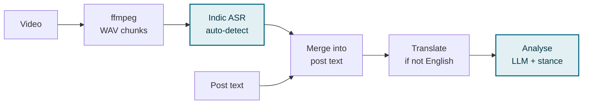

# Video Transcription Pipeline

**Code:** `backend/src/services/videoTranscriptionService.js`

**Called from:** `backend/src/services/grievanceService.js`, immediately before `analyzeContent()`

---

## Flow

Details: up to 3 clips per post; a failed transcription returns nothing and the
post is analysed on its caption alone.

## Language handling

The ASR model is called with **no language hint**, so it auto-detects and
returns the transcript in its own script — Devanagari for Hindi and
Chhattisgarhi, Latin for English.

Once the transcript is merged into the post text, the combined string goes
through language detection:

Translation happens **once**, on the whole merged string, before any model
reads it — rather than asking each stage to translate and reason in the same
pass, which was observed to invert meaning on regional-language text.

---

## Limits

| Limit              | Value           |
| ------------------ | --------------- |
| Clips per post     | 3               |
| Max file size      | 200 MB          |
| Download timeout   | 120 s           |
| Audio chunk length | 25 s            |
| Audio format       | 16 kHz mono WAV |
